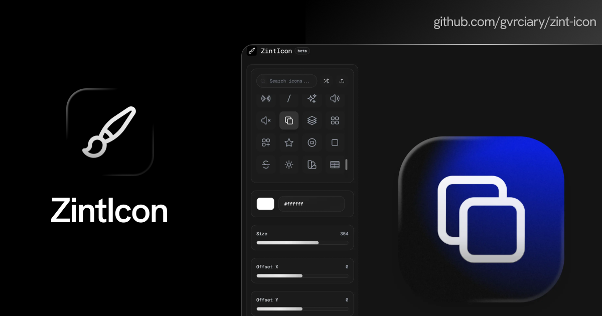

## `ZintIcon` - makes icon creation simple, beautiful, and fast.

<div align="center">



</div>

## Whats is ZintIcon?

ZintIcon is a minimalist icon generator web app that lets designers and developers create beautiful icons with smooth gradients, customizable backgrounds, and instant previews. Export your icons in SVG or ICO format, and enjoy a modern, intuitive interface built with SvelteKit.

### Features

- **Icon Generator**: Choose from a large library of SVG icons and customize them with gradients, colors, backgrounds, and more.
- **Export Options**: Download your icons as SVG, ICO or PNG files.
- **Modern UI**: Clean, responsive interface with reusable components and light/dark theme support.
- **Advanced Customization**: Adjust background, color, gradient, size, position, and more.
- **Glass Effect**: Apply a frosted glass style to your icons for a modern look.
- **Glow Effect**: Add glowing effects to make your icons stand out.
- **Mesh Gradients & 3D Backgrounds**: Create smooth mesh gradients and enable 3D backgrounds with rotation and lighting controls.
- **Noise, Contrast, Saturation, Brightness**: Fine-tune your icon backgrounds with advanced visual controls.
- **Custom Content**: Support for custom icons and images.

## Installation

1. **Clone the repository**
   ```bash
   git clone https://github.com/gvrciary/zint-icon.git
   cd zint-icon
   ```

2. **Install dependencies**
   ```bash
   npm install
   ```

3. **Run in development mode**
    ```bash
    npm run dev
    ```

## Credits

This project uses [Heroicons](https://heroicons.com/) for the UI icons.

## License

[](LICENSE)
